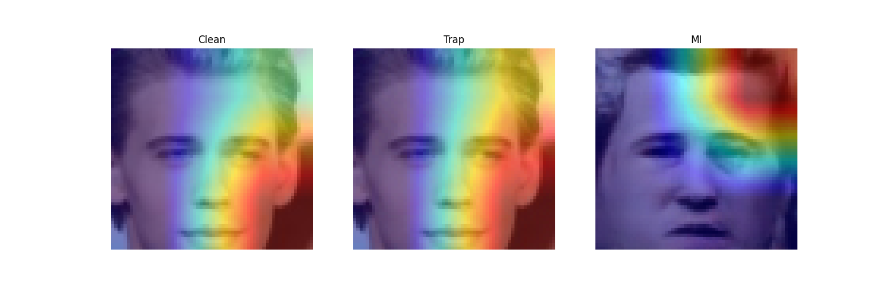
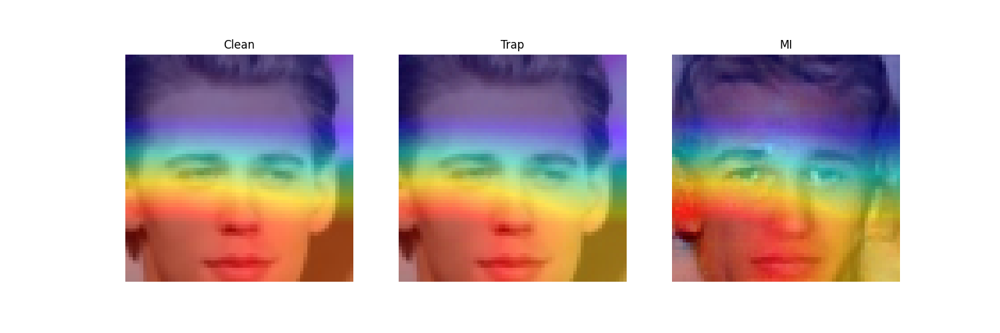

# Heat map for visualizing where the attack model focus on more in the model weights with trapdoor mechanism and without trapdoor mechanism


    - The result of attacking on model with trapdoor mechanism

    - The result of attacking on model without trapdoor mechanism

# Requirement

```bash
# create conda environment
conda create -n Grad_Cam python=3.9
conda activate Grad_Cam
# install pytorch 
conda install pytorch==1.10.0 torchvision==0.10.0 cudatoolkit=11.3 -c pytorch -c conda-forge
# install grad_cam
pip install pytorch-gradcam

```

# Steps

1. Train your trapdoor model by following the step in trap_MID README.
2. Reconstruct the images by attacking clean model and trapdoor model.
3. Check the path and names of images you want to check by grad_cam.
4. run grad_cam.py

```bash
python grad_cam.py
```